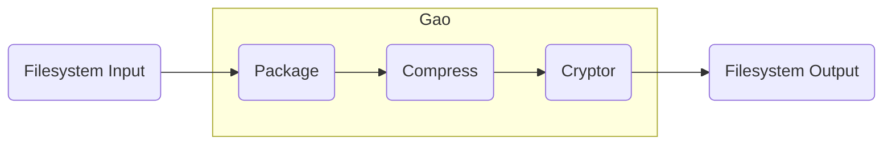

# Comprehensive Experiment of Software Development

## Overview

模块：

Compress：字节串的压缩与解压缩。

Package：将一堆东西压成字节串和将字节串。

Encrypt：字节串的加密与解密与验证。

Web：将字节串发送至服务器端。

## Gao

流程：



```cpp
typedef vector<uint8_t> bytevec;

bytevec gao(const string& path_str, compressor comp, cryptor crypt, uint64_t key) {
    vector<string> files = get_file(path_str);
    bytevec packed_data = pack(files);
    compressed_data = comp.compress(packed_data);
    encrypted_data = crypt.encrypt(compressed_data, key);
    return encrypted_data;
}

int ungao(const string& path_str, const bytevec& encrypted_data, compressor comp, cryptor crypt, uint64_t key) {
    try {
        bytevec decrypted_data = crypt.decrypt(encrypted_data, key);
        bytevec decompressed_data = comp.decompress(decrypted_data);
        unpack(decompressed_data);
    }
    catch (decrypt_failed) {
        
    }
    catch (decompress_failed) {
        
    }
    catch (unpack_failed) {
        
    }
    catch (...) {
        
    }
}
```

## Package

`vector<string>& get_file(const string& path_str)`：若`path`是一个目录，则收集其每个子文件的路径并返回。否则直接返回仅包含该路径的`vector`。

`bytevec pack(const vector<string>& path_str_v)`将`arg`中所有文件按二进制流打包成一个字节串，并记录目录结构信息在其开头。

`void unpack(const string& path, const bytevec& data)`将字节串`data`中的结构信息解包后将文件解压至根目录`path`下。

```cpp
vector<string>& get_file(const string& path_str);
bytevec pack(const vector<string>& path_str_v);
void unpack(const string& path, const bytevec& data);
```

## Compress

基类`class compressor`

其子类实现了某种压缩算法的压缩/解压缩。

`class not_a_compressor`：不进行压缩，原样返回。

`class huffman_compressor`：使用Huffman编码进行压缩。

```cpp
class compressor {
public:
    bytevec compress(const bytevec& data);
    bytevec decompress(const bytevec& data);
};

class not_a_compressor : public compressor;
class huffman_compressor : public compressor;
```

## Encrypt

基类`class cryptor`

其子类实现了某种加密算法的加密/解密/验证。

`encrypt`将key的md5值放在data首部。

`decrypt`计算key的md5值与data首部的md5值比较，若失败则抛出异常。

```cpp
class cryptor {
public:
    bytevec encrypt(const bytevec& data, uint64_t key);
    bytevec decrypt(const bytevec& data, uint64_t key);
};

class xor_cryptor : public cryptor;
```

